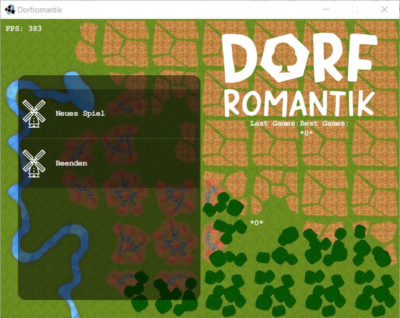
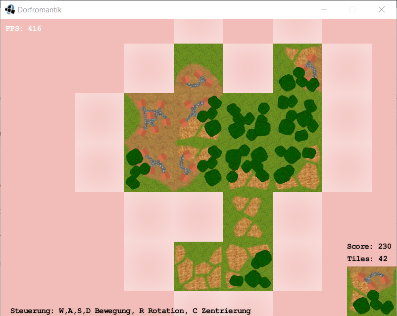

# Java Game Framework 2022/23 - TU Darmstadt

A clone of the game "Dorfromantik" built using the Slick2D game library and the Lightweight Java Game Library for the Java Game Framework course at the Technical University of Darmstadt.

Required Dependencies to be added to the Java Build Path:

- LWJGL 2.8.4
- Slick2D
- JUnit 4

## Main Menu

## Game

 d